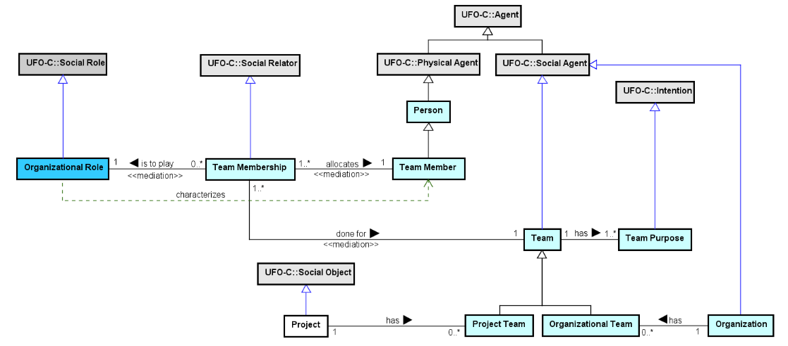

# 🔗 EO Extractor

This project connects to the GitHub API to extract **teams** and **members** from an organization and saves them to a **Neo4j** graph database modeled based on the **SEON/UFO-C ontology**.

---

## 📌 Features

- ✅ Fetches all teams from a GitHub organization
- ✅ Retrieves members of each team
- ✅ Models data using Pydantic (Team, Member, TeamWithMembers)
- ✅ Persists data in Neo4j using a semantic structure:
  - `Person`, `Team`, `TeamMembership`, `TeamMember`, `OrganizationalRole`

---

## 🧱 Ontological Structure (SEON/UFO-C)

The Enterprise Ontology (EO) aims at establishing a common conceptualization on the Entreprise domain, including organizations, organizational units, people, roles, teams and projects.




```plaintext
(:Person)-[:ALLOCATES]->(:TeamMember)
(:TeamMember)<-[:ALLOCATES]-(:TeamMembership)
(:TeamMembership)-[:IS_TO_PLAY]->(:OrganizationalRole)
(:TeamMembership)-[:DONE_FOR]->(:Team)
````

---

## 🚀 How to Run

### 1. Clone the repositorys

### 2. Install dependencies

```bash
pip install -r requirements.txt
```

### 3. Configure environment variables

Create a `.env` file with:

```
GITHUB_TOKEN=ghp_your_token
GITHUB_ORG=your-org-name
NEO4J_URI=bolt://localhost:7687
NEO4J_USER=neo4j
NEO4J_PASSWORD=your_password
```

### 4. Run the main script

```bash
python src/main.py
```

---

## 🛠 Project Structure

```
📁 src/
├── main.py                # Entry point
├── github_client.py       # GitHubClient class using PyGithub + Pydantic
├── sync_neo4j.py          # Class to send data to Neo4j
📁 models/
├── team.py                # Team and TeamWithMembers models
├── member.py              # MemberModel
```

---

## 🔎 Visualizing in Neo4j

Access:

```
http://localhost:7474
```

Then run these queries:

```cypher
MATCH (n) RETURN n LIMIT 100
```

```cypher
MATCH (p:Person)-[:ALLOCATES]->(:TeamMember)<-[:ALLOCATES]-(:TeamMembership)-[:IS_TO_PLAY]->(:OrganizationalRole),
      (:TeamMembership)-[:DONE_FOR]->(:Team)
RETURN p, TeamMember, TeamMembership, OrganizationalRole, Team
```

---

## 📦 Requirements

* Python 3.8+
* Neo4j Desktop or Neo4j running in Docker
* GitHub Personal Access Token with `read:org` scope
